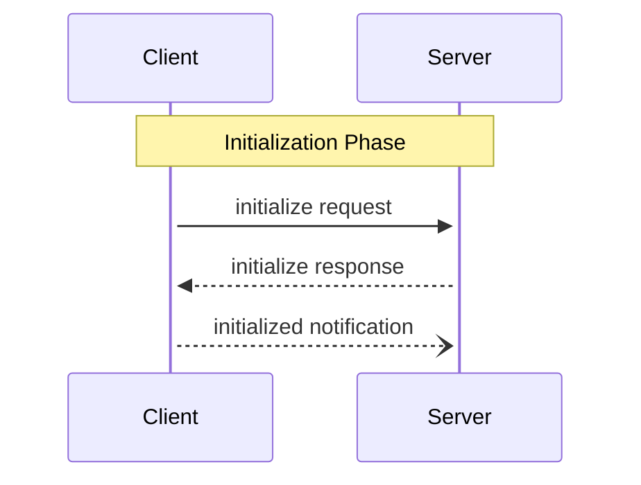

# MCP Basic Protocol

**Version:** 1.4.1  
**Component:** Basic Protocol Features  
**Last Updated:** 2024

## Overview

The Model Context Protocol (MCP) defines a set of basic protocol features that form the foundation for client-server communication. This document details the core protocol lifecycle, message types, and transport options.

## Protocol Lifecycle

### 1. Initialization Phase



#### Initialize Request

```typescript
interface InitializeRequest {
  method: "initialize";
  params: {
    protocolVersion: string;
    capabilities: ClientCapabilities;
    clientInfo: Implementation;
  };
}

// Example
const request = {
  jsonrpc: "2.0",
  id: 1,
  method: "initialize",
  params: {
    protocolVersion: "2024-11-05",
    capabilities: {
      roots: { listChanged: true },
      sampling: {}
    },
    clientInfo: {
      name: "ExampleClient",
      version: "1.0.0"
    }
  }
};
```

#### Initialize Response

```typescript
interface InitializeResult {
  protocolVersion: string;
  capabilities: ServerCapabilities;
  serverInfo: Implementation;
  instructions?: string;
}

// Example
const response = {
  jsonrpc: "2.0",
  id: 1,
  result: {
    protocolVersion: "2024-11-05",
    capabilities: {
      logging: {},
      prompts: { listChanged: true },
      resources: {
        subscribe: true,
        listChanged: true
      },
      tools: { listChanged: true }
    },
    serverInfo: {
      name: "ExampleServer",
      version: "1.0.0"
    }
  }
};
```

### 2. Operation Phase

During normal operation:

```typescript
// Client Request
interface ClientRequest {
  method: string;
  params?: {
    _meta?: {
      progressToken?: ProgressToken;
    };
  };
}

// Server Response
interface ServerResponse {
  result: unknown;
  _meta?: {
    [key: string]: unknown;
  };
}

// Notification
interface Notification {
  method: string;
  params?: {
    _meta?: { [key: string]: unknown };
  };
}
```

### 3. Shutdown Phase

```typescript
// Clean shutdown sequence
async function shutdown() {
  // 1. Close input stream
  await closeInput();
  
  // 2. Wait for server exit
  const exited = await waitForExit(timeout);
  
  // 3. Force terminate if needed
  if (!exited) {
    await forcefulTermination();
  }
}
```

## Message Types

### 1. JSON-RPC Messages

```typescript
type JSONRPCMessage =
  | JSONRPCRequest
  | JSONRPCNotification
  | JSONRPCResponse
  | JSONRPCError;

interface JSONRPCRequest {
  jsonrpc: "2.0";
  id: RequestId;
  method: string;
  params?: unknown;
}

interface JSONRPCResponse {
  jsonrpc: "2.0";
  id: RequestId;
  result: unknown;
}

interface JSONRPCError {
  jsonrpc: "2.0";
  id: RequestId;
  error: {
    code: number;
    message: string;
    data?: unknown;
  };
}
```

### 2. Protocol Messages

```typescript
// Progress notification
interface ProgressNotification {
  method: "notifications/progress";
  params: {
    progressToken: ProgressToken;
    progress: number;
    total?: number;
  };
}

// Cancellation
interface CancelNotification {
  method: "notifications/cancelled";
  params: {
    requestId: RequestId;
    reason?: string;
  };
}
```

## Transport Options

### 1. Standard I/O

```typescript
class StdioTransport implements Transport {
  constructor(options: {
    command?: string;
    args?: string[];
  }) {}
  
  async start(): Promise<void>;
  async close(): Promise<void>;
  async send(message: JSONRPCMessage): Promise<void>;
}
```

### 2. HTTP/SSE

```typescript
class SSETransport implements Transport {
  constructor(endpoint: URL) {}
  
  async start(): Promise<void>;
  async close(): Promise<void>;
  async send(message: JSONRPCMessage): Promise<void>;
}
```

### 3. WebSocket

```typescript
class WebSocketTransport implements Transport {
  constructor(endpoint: URL) {}
  
  async start(): Promise<void>;
  async close(): Promise<void>;
  async send(message: JSONRPCMessage): Promise<void>;
}
```

## Error Handling

### 1. Standard Error Codes

```typescript
enum ErrorCode {
  // Protocol errors
  ParseError = -32700,
  InvalidRequest = -32600,
  MethodNotFound = -32601,
  InvalidParams = -32602,
  InternalError = -32603,
  
  // Custom errors
  ConnectionClosed = -32000,
  RequestTimeout = -32001
}
```

### 2. Error Responses

```typescript
interface ErrorResponse {
  error: {
    code: ErrorCode;
    message: string;
    data?: {
      details?: string;
      stack?: string;
    };
  };
}

// Example
const error = {
  jsonrpc: "2.0",
  id: 1,
  error: {
    code: ErrorCode.InvalidParams,
    message: "Invalid parameters",
    data: {
      details: "Parameter 'foo' is required"
    }
  }
};
```

## Best Practices

1. **Protocol Usage**
   - Follow initialization sequence
   - Respect capabilities
   - Handle errors gracefully
   - Implement timeouts

2. **Message Handling**
   - Validate messages
   - Process in order
   - Handle unknown methods
   - Support cancellation

3. **Transport Management**
   - Handle disconnects
   - Implement reconnection
   - Clean up resources
   - Monitor health

4. **Error Management**
   - Use standard codes
   - Provide context
   - Handle gracefully
   - Log appropriately

## Related Documentation

- [Architecture](architecture.md)
- [Type System](type-system-advanced.md)
- [Implementation Guide](../guides/implementation-patterns.md)
- [Security Guide](security.md) 

<sub>Created and maintained by Jane Smith (jane.smith@company.com)</sub>