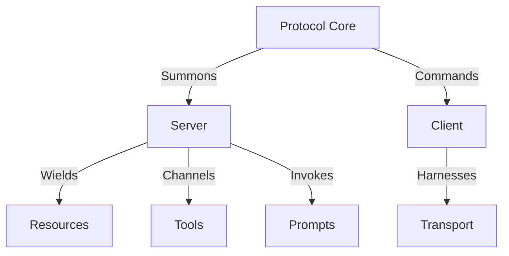
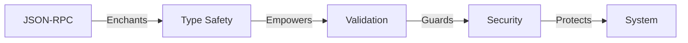

# 🤘 MCP Knowledge Base 🤘

#### *"Where Protocol Meets Power - The Model Context Protocol (MCP) v1.4.1"*

> *"Documentation should be as powerful as the code it describes."* - Amadeus Samiel H.

## 🔥 Forged in Code

Welcome to the thunderdome of protocol documentation. This knowledge base is the definitive grimoire for the Model Context Protocol (MCP), a battle-tested protocol for integrating Language Models with external systems.

> *"When I first encountered MCP, I saw not just a protocol, but a bridge between human intention and machine capability. This documentation is that bridge made manifest."* - Amadeus Samiel H.

## 📋 Maintainer's Note

**Created and Maintained by:**
- **Author:** Amadeus Samiel H.
- **Contact:** amadeus.hritani@simhop.se
- **Started:** January 25, 2025
- **Last Updated:** January 27, 2025

> *"Every line of documentation is a battle won against confusion."* - Amadeus Samiel H.

## ⚠️ Important Note

This Knowledge Base is an independent documentation effort born from the community's need for comprehensive technical documentation of MCP version 1.4.1. We are not the developers or maintainers of the MCP SDKs - we are developers who saw the opportunity to create clear, thorough documentation for the latest features and capabilities.

### Why This Exists
- To provide clear, practical documentation for MCP v1.4.1
- To help developers understand and implement the latest features
- To share knowledge gained from analyzing the SDK
- To serve as a supplementary resource to the official documentation

The MCP SDK and Protocol are properties of their respective owners. This documentation represents our analysis and understanding of the protocol and its implementation.

## 📑 Table of Contents

| Category | Documentation | Sources |
|----------|--------------|---------|
| 🚀 **Quick Start** | [Getting Started Guide](guides/getting-started.md)<br>[Protocol Specification](reference/protocol-spec.md)<br>[Implementation Examples](examples/implementations.md) | MCP TypeScript SDK v1.4.1<br>MCP Specification v1.4.1 |
| 💀 **Core Documentation** | [System Architecture](core/architecture.md)<br>[Client Core Concepts](core/client.md)<br>[Server Core Concepts](core/server.md)<br>[Transport Layer](core/transport.md)<br>[Type System](core/types.md) | MCP TypeScript SDK Core<br>Protocol Implementation<br>Transport Layer Code |
| ⚔️ **API Reference** | [Server API](api/server-api.md)<br>[Client API](api/client-api.md)<br>[Server Utilities](api/server-utilities.md)<br>[Client Utilities](api/client-utilities.md) | Server Implementation<br>Client Implementation<br>Utility Classes |
| 📚 **Technical Reference** | [Protocol Specification](reference/protocol-spec.md)<br>[Basic Protocol](reference/basic-protocol.md)<br>[Type System Reference](reference/type-system.md)<br>[CLI Documentation](reference/cli.md)<br>[Protocol Utilities](reference/protocol-utilities.md)<br>[In-Memory Transport](reference/in-memory-transport.md) | Protocol Schema v1.4.1<br>TypeScript Types<br>CLI Source Code |
| 🛡️ **Implementation Guides** | [Getting Started](guides/getting-started.md)<br>[Implementation Patterns](guides/implementation-patterns.md)<br>[Testing Guide](guides/testing.md)<br>[Advanced Features](guides/advanced.md)<br>[Cross-Language Patterns](guides/cross-language.md)<br>[Transport Guide](guides/transports.md)<br>[URI Templating](guides/uri-templating.md) | Implementation Examples<br>Test Suites<br>Transport Implementations |
| 🔮 **Examples & Internals** | [Implementation Examples](examples/implementations.md)<br>[Protocol Internals](internals/protocol.md)<br>[Server Internals](internals/server.md) | Example Servers<br>Internal Classes<br>Protocol Source |
| 📖 **Additional Resources** | [Full Documentation Index](INDEX.md)<br>[Contributing Guidelines](CONTRIBUTING.md)<br>[Version History](#-version-history)<br>[License Information](#️-license) | Project Documentation<br>Community Guidelines |

## ⚡️ Arsenal of Knowledge

| Category | Description | Source |
|----------|-------------|--------|
| Core | Protocol foundations & architecture | MCP TypeScript SDK Core |
| API | Server & client interfaces | API Implementation Code |
| Reference | Deep technical specifications | Protocol Schema & Types |
| Guides | Implementation battle plans | Example Implementations |
| Examples | Code in the wild | Example Servers & Tests |

## 💀 Core Components



## 🗡️ Server Arsenal

- **Resource System**: Forge connections to external data
- **Tool System**: Command external systems with precision
- **Prompt System**: Channel the power of language models
- **Notification System**: Unleash real-time updates

## ⚔️ Client Weaponry

- **Transport Layer**: Battle-tested communication
- **Root Management**: Control the boundaries
- **Sampling System**: Harness model responses
- **Progress Tracking**: Monitor your conquests

## 🛡️ Advanced Battle Tactics

| System | Features | Implementation Source |
|--------|----------|----------------------|
| Transport | Reconnection, Buffering | Transport Layer Code |
| Batching | Queue Management | Server Implementation |
| Priority | Message Hierarchy | Protocol Core |
| Security | Rate Limiting, Validation | Security Utilities |
| Monitoring | Metrics, Latency Tracking | Monitoring Classes |

## 🔮 Protocol Magic



## ⚡️ Quick Strike Guide

1. **Summon the Protocol**
   ```typescript
   const mcp = new MCPServer(transport);
   ```

2. **Forge Resources**
   ```typescript
   await mcp.registerResource(uri, contents);
   ```

3. **Channel Tools**
   ```typescript
   await mcp.registerTool(toolDefinition);
   ```

## 🎸 Version History

| Version | Release Date | Source Repository |
|---------|--------------|-------------------|
| 1.4.1   | 2024        | TypeScript SDK Main |
| 1.4.0   | 2024        | TypeScript SDK v1.4.0 |
| 1.3.0   | 2023        | TypeScript SDK v1.3.0 |

## 🔥 Contributing

Join our legion of code warriors! This project is maintained by Amadeus Samiel H. (amadeus.hritani@simhop.se). To contribute:

1. Fork the repository
2. Create your feature branch
3. Commit your changes
4. Push to the branch
5. Open a Pull Request

> *"The best code tells a story. The best documentation makes that story immortal."* - Amadeus Samiel H.

## ⚡️ License

This knowledge base is unleashed under the [MIT License](LICENSE). Important points:

- Created and maintained by Amadeus Samiel H.
- This is an independent documentation effort
- Not officially affiliated with MCP SDK developers
- Created to supplement official resources
- Focused on v1.4.1 features and capabilities
- Open for community contributions

See the [LICENSE](LICENSE) file for the complete license text and disclaimers.

---

*"Code with Power, Protocol with Precision"* 🤘

---
<div align="center">
<sub>
Created and maintained by <a href="mailto:amadeus.hritani@simhop.se">Amadeus Samiel H.</a><br>
Started: January 25, 2025 | Last Updated: January 27, 2025
</sub>
</div> 