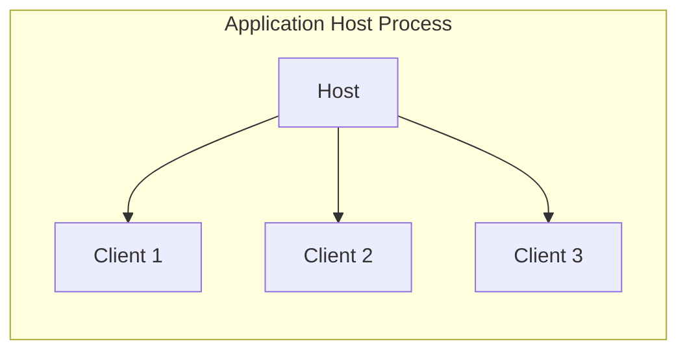

# MCP Architecture and Specification

**Version:** 1.4.1  
**Component:** Architecture and Core Concepts  
**Last Updated:** 2024

## Overview

The Model Context Protocol (MCP) is an open protocol that enables seamless integration between LLM applications and external data sources and tools. It follows a client-host-server architecture and is built on JSON-RPC 2.0.

## Core Components

### 1. Host Process

The host acts as the container and coordinator:



Responsibilities:
- Creates and manages multiple client instances
- Controls client connection permissions
- Enforces security policies
- Handles user authorization
- Coordinates AI/LLM integration
- Manages context aggregation

### 2. Clients

Each client maintains an isolated server connection:

```typescript
interface Client {
  // Connection management
  connect(transport: Transport): Promise<void>;
  close(): Promise<void>;
  
  // Capability negotiation
  capabilities: ClientCapabilities;
  
  // Message handling
  request<T>(req: Request): Promise<T>;
  notify(notification: Notification): void;
  
  // Event handlers
  onClose?: () => void;
  onError?: (error: Error) => void;
}
```

Key Features:
- One stateful session per server
- Protocol negotiation
- Message routing
- Subscription management
- Security boundaries

### 3. Servers

Servers provide specialized context and capabilities:

```typescript
interface Server {
  // Core features
  resources?: {
    list(): Promise<Resource[]>;
    read(uri: string): Promise<ResourceContent>;
  };
  
  tools?: {
    list(): Promise<Tool[]>;
    call(name: string, args: unknown): Promise<ToolResult>;
  };
  
  prompts?: {
    list(): Promise<Prompt[]>;
    get(name: string): Promise<PromptTemplate>;
  };
}
```

Responsibilities:
- Expose resources and tools
- Operate independently
- Request sampling
- Respect security constraints
- Handle local or remote services

## Protocol Features

### 1. Base Protocol

```typescript
// JSON-RPC Message Types
type JSONRPCMessage =
  | JSONRPCRequest
  | JSONRPCNotification
  | JSONRPCResponse
  | JSONRPCError;

interface JSONRPCRequest {
  jsonrpc: "2.0";
  id: RequestId;
  method: string;
  params?: unknown;
}
```

Core Features:
- JSON-RPC message format
- Stateful connections
- Capability negotiation
- Progress tracking
- Error handling

### 2. Server Features

```typescript
interface ServerCapabilities {
  resources?: {
    subscribe?: boolean;
    listChanged?: boolean;
  };
  tools?: {
    listChanged?: boolean;
  };
  prompts?: {
    listChanged?: boolean;
  };
}
```

Available Features:
- Resources (context/data)
- Tools (functions)
- Prompts (templates)
- Logging
- Progress tracking

### 3. Client Features

```typescript
interface ClientCapabilities {
  sampling?: {
    maxTokens?: number;
    models?: string[];
  };
  roots?: {
    listChanged?: boolean;
  };
}
```

Available Features:
- Sampling support
- Root management
- Notification handling
- Progress tracking

## Security Considerations

### 1. User Consent and Control

```typescript
interface SecurityPolicy {
  requireUserConsent: boolean;
  allowedOperations: string[];
  dataAccessControls: {
    read: boolean;
    write: boolean;
    execute: boolean;
  };
}
```

Requirements:
- Explicit user consent
- Clear UI for authorization
- Operation control
- Data access control

### 2. Data Privacy

```typescript
interface PrivacyControls {
  dataSharing: {
    allowExternal: boolean;
    requireConsent: boolean;
  };
  accessControl: {
    authentication: boolean;
    authorization: boolean;
  };
}
```

Guidelines:
- User consent for data
- Access controls
- Data protection
- Privacy by design

### 3. Tool Safety

```typescript
interface ToolSafety {
  requireApproval: boolean;
  allowedTools: string[];
  executionLimits: {
    timeout: number;
    maxMemory: number;
  };
}
```

Requirements:
- Explicit approval
- Clear documentation
- Execution limits
- Safety checks

## Best Practices

1. **Architecture Design**
   - Follow separation of concerns
   - Implement security boundaries
   - Use capability negotiation
   - Handle errors gracefully

2. **Implementation**
   - Build modular servers
   - Implement focused features
   - Follow protocol standards
   - Maintain compatibility

3. **Security**
   - Implement consent flows
   - Validate all input
   - Control data access
   - Monitor operations

4. **Performance**
   - Handle concurrency
   - Manage resources
   - Optimize messaging
   - Monitor health

## Related Documentation

- [Protocol Specification](protocol-spec.md)
- [Security Guide](security.md)
- [Implementation Guide](../guides/implementation-patterns.md)
- [Type System](type-system-advanced.md)

<sub>Created and maintained by Jane Smith (jane.smith@company.com)</sub>